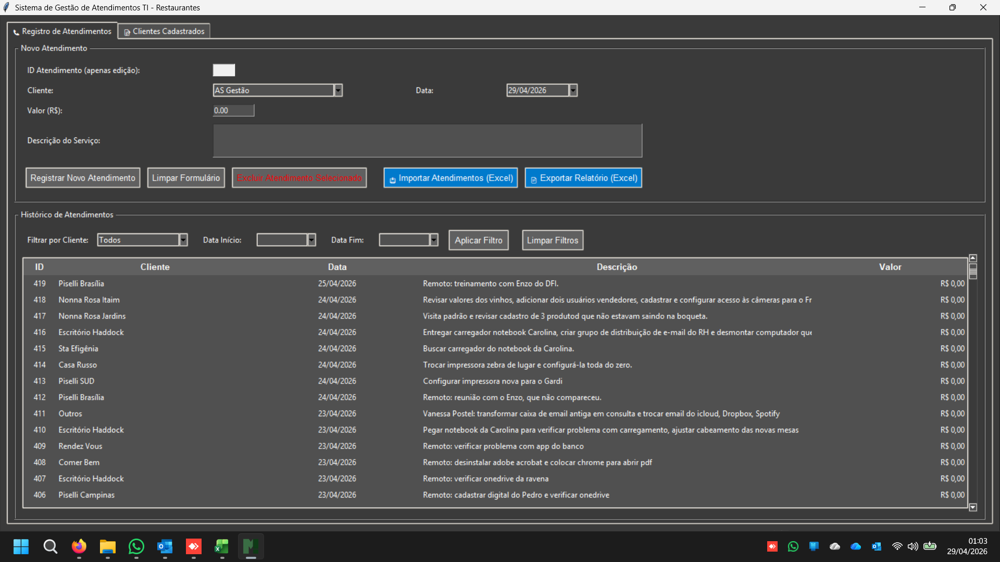
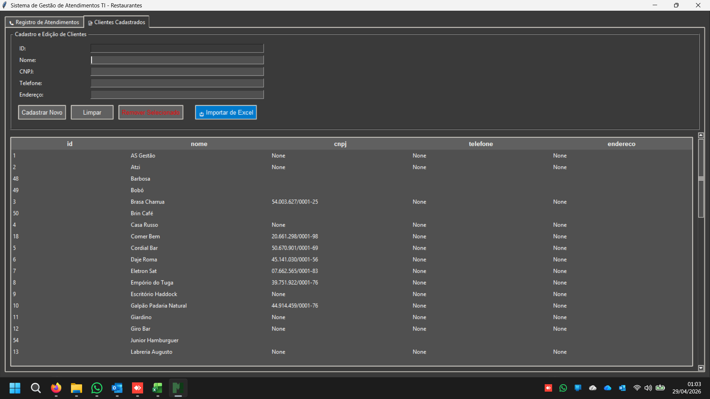

# 🛠️ Sistema de Gestão de Atendimentos TI - Restaurantes

Sistema desenvolvido para controle e organização de atendimentos técnicos, clientes e histórico de serviços prestados.

## 🚀 O que faz

### 📋 Registro de Atendimentos
- Cadastro de novos atendimentos
- Associação com cliente
- Registro de:
  - Data
  - Descrição do serviço
  - Valor
- Edição e exclusão de atendimentos

### 📊 Histórico completo
- Listagem de todos os atendimentos realizados
- Filtros por:
  - Cliente
  - Data inicial / final
- Visualização organizada por:
  - ID
  - Cliente
  - Data
  - Descrição
  - Valor

### 👥 Gestão de Clientes
- Cadastro de clientes com:
  - Nome
  - CNPJ
  - Telefone
  - Endereço
- Edição e remoção de clientes
- Listagem completa

### 📥📤 Integração com Excel
- Importação de dados via Excel
- Exportação de relatórios em Excel

## 🖥️ Interface

Sistema com interface desktop focada em produtividade e uso rápido no dia a dia.

## 🖼️ Preview

### Registro de Atendimentos

### Cadastro de Clientes

## 🎯 Objetivo

Centralizar e organizar todos os atendimentos técnicos realizados, facilitando:

- Controle de serviços prestados
- Histórico por cliente
- Gestão financeira básica
- Acompanhamento de rotina operacional

## 📌 Diferenciais

- Pensado para uso real no dia a dia
- Interface simples e direta
- Integração com Excel (prático para relatórios)
- Organização clara por cliente

---

**Desenvolvido para uso operacional da Marques Tech 🚀**
